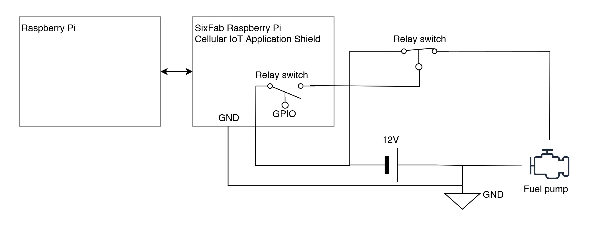

# Code of Conscience

## About
Today, despite its protective status, one third of the world's reserves are under threat from human activity. It’s hard to monitor and stop humans from destroying our planet, but could we stop the machines they use?

Code of Conscience is an open-source software based intervention that can shutdown heavy machines in protected land areas. To make the system available for all vehicles (including older ones) we are designing a small, low-cost chip - with GPS, 4G and data storage in collaboration with Tekt Industries.

The proof of concept system code is available here for free to everyone.

Any Construction Equipment company can access and adapt it to their own system or any company can demand it to be implemented on their or their partners fleet.

Find out more at https://www.codeofconscience.org/

## Validation

This repository documents a validation test performed at the Organ Pipes National Park, which is a protected area located near Melbourne, Australia. The code used for this validation shows how it is possible to use a slightly modified version of the base code, and off-the-shelf components (documented below) to stop a vehicle entering a protected zone.

## Process

This test uses a soft shut-down approach, first warning the driver before initiating a shutdown at a later time (in this instance, 5 minutes).

The sequence is as follows:

1. The Code of Conscience code constantly checks the current location and compares it to the protected area database
2. The vehicle enters a protected area
3. The driver is sent a warning SMS that a protected area has been entered, giving them time to retreat
4. If the driver does not retreat within 5 minutes, the engine will be shut down

## Validation Kit
An off-the-shelf validation kit to run the Code of Conscience Python code was constructed using the following:

1. Raspberry Pi Model 3+: https://www.adafruit.com/product/3775
2. SixFab Raspberry Pi Hat: https://sixfab.com/product/raspberry-pi-cellular-iot-application-hat/
3. Weatherproof case: https://sixfab.com/product/raspberry-pi-ip65-weatherproof-iot-project-enclosure/

Details of the Code of Conscience hardware architecture can be found [here](hardware/CodeofConscienceValidationHardwareArchitecture.png), and the SixFab hat schematic can be found [here](hardware/Sixfab_RPi_CellularIoT_App_Hat_Schematic.PDF).

## Validation Schematic
We tested the vehical shutdown by wiring a high-current, normally-closed automotive relay into the fuel pump circuit of our test vehicle (an SUV). When the code detects that the vehicle is in a protected area, it fires the relay. This action cuts power to the fuel pump and ultimately stops the vehicle safely, keeping all other electronics operational.

## Next Steps
All of the hardware we've used in this POC is readily accessible to anyone. AKQA are working closely with our partner Tekt Industries to develop V2 of a low cost bespoke version of the hardware and code to be embedded in machines without existing telematics.

Lastly, this project is more than the code and the parts that run it. It's a big idea that requires the will of companies, organisations, governments or people of the planet to help implement and scale it.

*Technology is just the expression of other interests* - Shoshana Zuboff